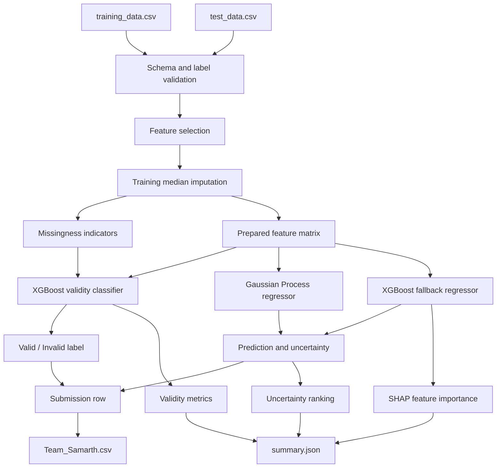
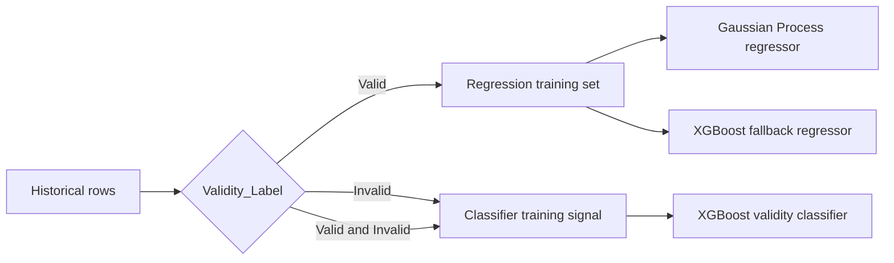

# System Architecture

## Scope

The system processes historical engineer-labelled test records and produces
three outputs for new records:

- a validity label;
- a reference-parameter prediction;
- an uncertainty score used to prioritize review.

The design is batch-oriented and can be run locally with one command. No
external service is required for the submitted workflow.

## Processing flow



## Model training boundary



Regression is intentionally trained only from records labelled `Valid`.
Invalid records remain important to the classifier, because they provide
examples of sensor faults and inconsistent measurements.

## Runtime components

| Component | Responsibility | Input | Output |
| --- | --- | --- | --- |
| Loader | Read files and verify columns | CSV files | Data frames |
| Preprocessor | Select features, impute values, record missingness | Data frames | Prepared matrices |
| Validity classifier | Detect unreliable records | Prepared classifier features | Validity label |
| Gaussian Process regressor | Predict the reference parameter and uncertainty | Valid-record feature model | Prediction and standard deviation |
| XGBoost fallback | Provide a tree-based comparison and explanation model | Valid-record feature model | Fallback prediction and SHAP values |
| Exporter | Produce challenge files | Predictions and metrics | CSV and JSON |

## Data and output contracts

The training file must contain `Test_ID`, all feature columns,
`Reference_Parameter`, and `Validity_Label`. The test file must contain
`Test_ID` and all feature columns.

The submission contains exactly:

```text
Test_ID,Predicted_Reference_Parameter,Valid / Invalid
```

The summary also records the three highest-uncertainty records separately from
the three records with the highest predicted reference parameter. This keeps
review priority and thermal value distinct.

## Operational considerations

- Medians are calculated from training data and reused for test data.
- Random seeds are fixed for repeatable model fitting.
- The script fails early when required files, columns, or labels are invalid.
- `summary.json` is intended for review; `Team_Samarth.csv` is the submission artifact.
