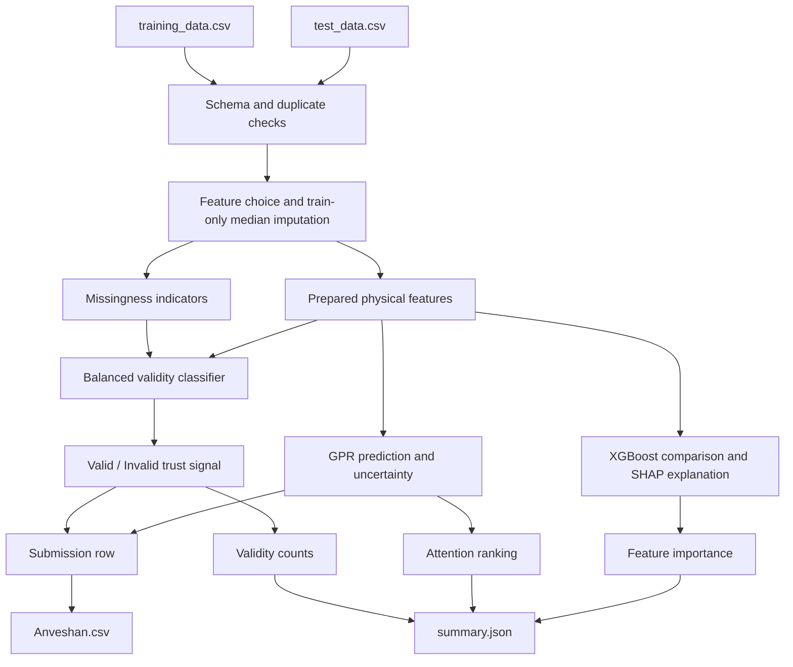
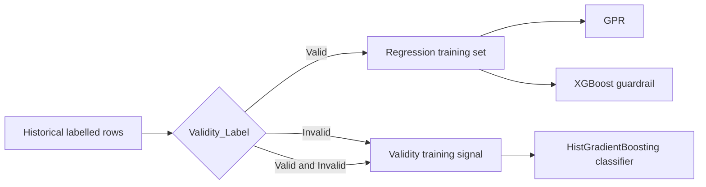

# Team Anveshan - System Architecture

## The trust story

The system is intentionally two-stage. A reference-parameter prediction is
only as useful as the measurement behind it, so the first question is whether
the record looks valid. The second question is what parameter value is
consistent with the valid training records. In practice, a `Valid` label
supports normal interpretation; an `Invalid` label says to investigate the
measurement before using its prediction. GPR uncertainty adds a second review
signal for records that are hard to place, including records the classifier
does not reject.

This is a batch workflow, not a live control system. It does not silently
turn an uncertain prediction into an operating decision.

## Processing flow



## Model boundary and decisions



The classifier uses both classes because invalid examples are needed to learn
the trust boundary. Regression uses valid rows only so known-bad measurements
do not define the physical relationship. Repeated shuffled 5-fold CV with
three repeats selected GPR on seven features, excluding `Sensor_S4`. The
selected GPR scored R2 **0.9952 +/- 0.0009**, MAE **0.5150**, and RMSE
**0.7366**. The classifier scored F1 **0.9753 +/- 0.0064**, balanced accuracy
**0.8698**, and ROC AUC **0.9500**. XGBoost, ExtraTrees, RandomForest, and
HistGradientBoosting regressors were compared; XGBoost remains in the
pipeline as a guardrail rather than the selected model.

The physical reading is also kept grounded. `Load_Current_A` is the strongest
feature in the XGBoost explanation, which is plausible because resistive
heating scales with current squared. `Sensor_S1`, `Sensor_S2`, and `Sensor_S3`
add thermal context; voltage, duration, and ambient temperature describe the
loading and baseline. These are interpretations of the observed data, not
proof of causality.

## Runtime components

| Component | Responsibility | Output |
| --- | --- | --- |
| Loader | Check required columns, labels, duplicates, and IDs | Validated data frames |
| Preprocessor | Choose predictors, impute from training medians, retain missingness | Feature matrices |
| Validity model | Estimate whether a record is trustworthy for interpretation | `Valid` or `Invalid` |
| GPR | Predict the reference parameter and its standard deviation | Prediction and uncertainty |
| XGBoost guardrail | Provide a comparison prediction and SHAP feature importance | Comparison and explanation |
| Exporter | Keep the submission and audit summary reproducible | CSV and JSON |

## Current result, limitations, and future work

The current run produced 350 predictions and 31 `Invalid` labels. The model
has no temporal grouping, no external calibration data, and no equipment
limit supplied by the challenge, so it cannot claim safe operating limits.
The data may not be stationary across campaigns, and median imputation is
only a practical baseline for missing measurements. Cross-validation estimates
are evidence of performance on this dataset, not a guarantee on new hardware.

Future work would add time- and equipment-aware validation, collect more
engineer-reviewed fault examples, calibrate the uncertainty against observed
error, and test approved derived variables such as thermal gradients. A
digital-twin deployment would first ingest timestamped records, validate and
align them, run the same validity and regression services, then send
uncertainty or invalid rows to a human review queue. Only after that
validation would any alerting or historian integration be considered.

## Output contract

`Anveshan.csv` has exactly:

```text
Test_ID,Predicted_Reference_Parameter,Valid / Invalid
```

The official ZIP contains exactly `Anveshan.csv`, `summary.json`, `pipeline.py`,
and `methodology_note.md`.
